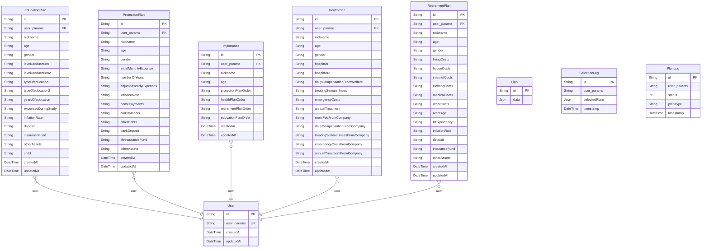

# financial-health-check
> Generated by [`prisma-markdown`](https://github.com/samchon/prisma-markdown)

- [default](#default)

## default

### `EducationPlan`

**Properties**
  - `id`: 
  - `user_params`: 
  - `nickname`: 
  - `age`: 
  - `gender`: 
  - `levelOfeducation`: 
  - `levelOfeducation2`: 
  - `typeOfeducation`: 
  - `typeOfeducation2`: 
  - `yearsOfeducation`: 
  - `expensesDuringStudy`: 
  - `inflationRate`: 
  - `deposit`: 
  - `insuranceFund`: 
  - `otherAssets`: 
  - `child`: 
  - `createdAt`: 
  - `updatedAt`: 

### `ProtectionPlan`

**Properties**
  - `id`: 
  - `user_params`: 
  - `nickname`: 
  - `age`: 
  - `gender`: 
  - `initialMonthlyExpense`: 
  - `numberOfYears`: 
  - `adjustedYearlyExpenses`: 
  - `inflationRate`: 
  - `homePayments`: 
  - `carPayments`: 
  - `otherDebts`: 
  - `bankDeposit`: 
  - `lifeInsuranceFund`: 
  - `otherAssets`: 
  - `createdAt`: 
  - `updatedAt`: 

### `importance`

**Properties**
  - `id`: 
  - `user_params`: 
  - `nickname`: 
  - `age`: 
  - `protectionPlanOrder`: 
  - `healthPlanOrder`: 
  - `retirementPlanOrder`: 
  - `educationPlanOrder`: 
  - `createdAt`: 
  - `updatedAt`: 

### `User`

**Properties**
  - `id`: 
  - `user_params`: 
  - `createdAt`: 
  - `updatedAt`: 

### `HealthPlan`

**Properties**
  - `id`: 
  - `user_params`: 
  - `nickname`: 
  - `age`: 
  - `gender`: 
  - `hospitals`: 
  - `hospitals2`: 
  - `dailyCompensationFromWelfare`: 
  - `treatingSeriousIllness`: 
  - `emergencyCosts`: 
  - `annualTreatment`: 
  - `roomFeeFromCompany`: 
  - `dailyCompensationFromCompany`: 
  - `treatingSeriousIllnessFromCompany`: 
  - `emergencyCostsFromCompany`: 
  - `annualTreatmentFromCompany`: 
  - `createdAt`: 
  - `updatedAt`: 

### `RetirementPlan`

**Properties**
  - `id`: 
  - `user_params`: 
  - `nickname`: 
  - `age`: 
  - `gender`: 
  - `livingCosts`: 
  - `houseCosts`: 
  - `internetCosts`: 
  - `clothingCosts`: 
  - `medicalCosts`: 
  - `otherCosts`: 
  - `retireAge`: 
  - `lifExpectancy`: 
  - `inflationRate`: 
  - `deposit`: 
  - `insuranceFund`: 
  - `otherAssets`: 
  - `createdAt`: 
  - `updatedAt`: 

### `Plan`

**Properties**
  - `id`: 
  - `data`: 

### `SelectionLog`

**Properties**
  - `id`: 
  - `user_params`: 
  - `selectedPlans`: 
  - `timestamp`: 

### `PlanLog`

**Properties**
  - `id`: 
  - `user_params`: 
  - `status`: 
  - `planType`: 
  - `timestamp`: 